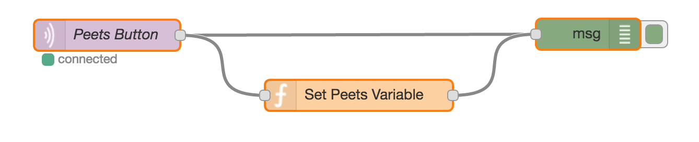

# NodeRed Amazon Dash Button Script & Flow

The script included in this package supports capturing [Amazon Dash](http://www.amazon.com/b?node=10667898011) button presses using the npm [node-dash-button](https://www.npmjs.com/package/node-dash-button) package.

## dash.js

This node.js script uses the node-dash-button module to monitor for Dash button presses. When a button is pressed, it sends an MQTT message that can be captured in NodeRed via the MQTT Node.

You'll need to make two changes to the dash.js script.  Change the IP address for your MQTT server, the MQTT topic being sent and change the MAC address associated with your Dash button.

## dash.flow

This is a NodeRed flow that captures the button press with an MQTT node and then runs a Function Node that toggles a global variable.

You'll want to modify the MQTT node topic to match the topic that you set in dash.js and you'll want to change the name of the variable set.

## dash.sh

This is an init.d startup script. Modify the PROCDIR variable at the top of the script with the directory where you've placed dash.js.

Copy this file to `/etc/init.d/dash`. Run the commands to install the script to start it up as a daemon.

```
sudo chmod +x /etc/init.d/dash
sudo systemctl enable dash.service
sudo service dash start
```


